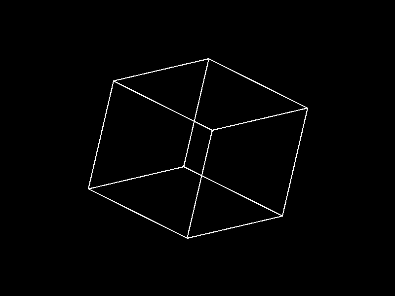

# Rotating Cube

A simple demo that renders and rotates a 3D cube using [SDL2](https://www.libsdl.org). The cube is defined by its 8 vertices, which are rotated about the X and Y axes based on user input. The edges are drawn with a classic Bresenham line algorithm, and an isometric projection is used to project 3D points onto the 2D screen.

 

## Features
- **Manual 3D Rotation**: Rotate the cube around its X/Y axes in response to arrow key inputs.
- **Isometric Projection**: Maps the 3D coordinates onto the 2D window surface.
- **Bresenham's Algorithm**: Implements line drawing without the need for floating-point arithmetic (beyond the rotation/projection steps).
- **Keyboard Controls**:
  - **Up / Down** arrows: Rotate around X-axis.
  - **Left / Right** arrows: Rotate around Y-axis.
  - **Q** or close the window to quit.

## Getting Started

### Prerequisites
- [SDL2](https://www.libsdl.org) development libraries installed.
- A C compiler (e.g., GCC or Clang).

### Building
1. Clone or download this repository.
2. In the project directory, run:
   ```bash
   make
   ```

### Running
After building, run the compiled executable:
```bash
./rotating-cube
```

### Cleaning Up
Remove the compiled executable with:
```bash
make clean
```
